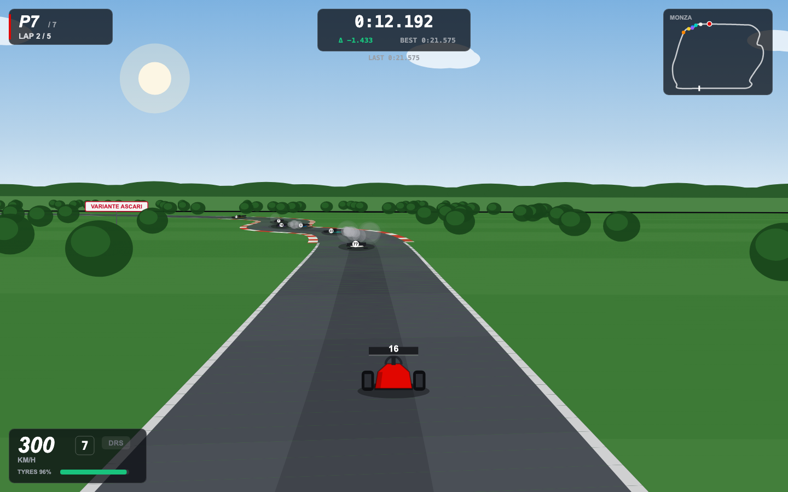
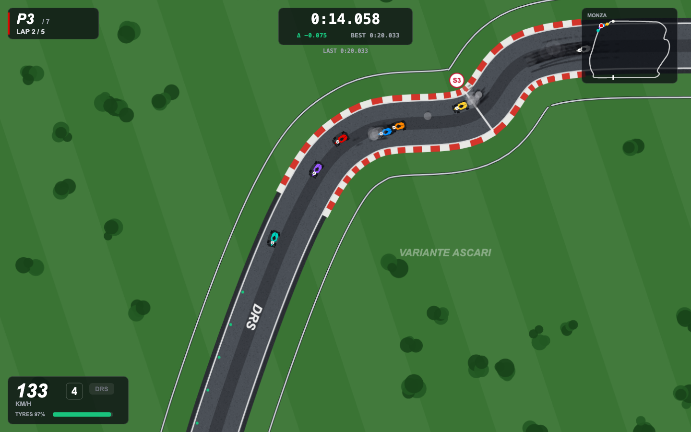

# 🏎️ Apex GP — Monza

A complete, realistic Formula 1 racing game that runs in your web browser — seen **from behind your car, like a real race driver**, with the road rushing toward the horizon. One file, no installation, works fully offline. Qualify, start from your earned grid slot, and race 6 AI drivers over 5 laps around a Monza-inspired circuit.

---

## ▶️ How to play (30 seconds)

1. **Open the game.** Double-click `index.html`, or drag it into Chrome, Edge, or Firefox.
2. **Pick your car.** Choose a livery colour and **type your race number** (1–99) on the start menu.
3. **Set your comfort level.** Two settings on the menu tune how the game drives:
   - **Steering sensitivity** — *Comfort* (gentle, default) / *Standard* / *Sharp* (instant).
   - **Game speed** — *Relaxed* (default) / *Standard* / *Full*. This slows the **whole race** — you *and* the AI — so it's never unfair, and lap times stay comparable between settings.
4. **Click "Start Qualifying"** and set your fastest lap.
5. **Race.** After qualifying you line up on the grid, wait for five red lights, and go.

Your colour, number, and settings are remembered for next time.

That's it — no downloads, no accounts, no internet connection needed.

---

## 🎮 Controls

| Key | Action |
|-----|--------|
| **W** or **↑** | Throttle |
| **S** or **↓** | Brake — *hold it while stopped to reverse* |
| **A** / **D** or **←** / **→** | Steer left / right |
| **SPACE** | Activate **DRS** (only works inside a DRS zone) |
| **V** | Switch camera: driver's view ↔ top-down |
| **P** | Pause / resume |
| **E** | End qualifying early (skip straight to the grid) |

> 💡 Throttle builds up progressively — flooring it from a standstill will spin the wheels and cost you grip. Feed it in smoothly off the line.

---

## 📷 Camera views

The game starts in the **driver's view** — a chase camera just behind your car, with proper perspective: the road narrows to the horizon, corners sweep into view as you turn, curbs and corner-name boards rush past, and the cars ahead grow as you catch them. Your car leans with the corners, sways with your steering, shows a glowing rain light when you brake, and its rear wing visibly opens when DRS is active.

Press **V** at any time to switch to the classic **top-down** view (handy for learning the track layout), and **V** again to jump back into the cockpit.

> 🏁 **Driving tip for the driver's view:** use the **corner-name boards** and **red-and-white curbs** as braking markers, and glance at the **minimap** to know what's coming. Brake when you see the chicane's curbs snaking ahead — if you wait until the corner fills the screen, you're in the gravel.

---

## 🏁 A full race weekend

The game follows a real F1 weekend structure:

1. **Qualifying** — 3 laps on an empty track, alone. Your **fastest single lap** decides where you start.
2. **Grid** — a classification screen shows everyone's qualifying times and your starting position.
3. **The start** — five red lights come on one by one. When they go out, *go*. (You're held in place until then.)
4. **The race** — 5 laps, wheel-to-wheel with 6 AI cars.
5. **Results** — final standings, gaps, and everyone's best lap. From here you can **Race Again** (same grid) or return to the **Menu**.

While you're on the menu, a demo race runs in the background so there's always something happening on screen.

---

## 📊 Reading the HUD

Everything on screen is styled like a TV broadcast graphic:

- **Top-left** — your **position** (e.g. `P3 / 7`) and **current lap**.
- **Top-centre** — your **live lap timer**, the **delta** to your own best lap (green = you're faster, red = slower), and your **best lap** time.
- **Top-right** — a **minimap** of the whole circuit with every car as a coloured dot; yours is outlined in white.
- **Bottom-left** — **speed** (km/h), current **gear**, a **DRS** indicator, and a **tyre wear** bar.

### What the tyre bar means
Your tyres start at **100%** and wear down as you race. Worn tyres have less grip, so your lap times drift off late in a race. The bar turns from **green → yellow → red** as they degrade. Smooth driving preserves them; sliding, wheelspin, and locking up under braking chew them up faster.

### DRS (the speed boost)
Two stretches of track are **DRS zones**, marked with green dots and a big "DRS" sign painted on the tarmac. When you're inside one, press and hold **SPACE** to open your rear wing — drag drops and you gain top speed. The DRS pill in the HUD lights up green when it's active. Use it to close in on the car ahead down the straights.

---

## 🧠 What makes it feel real

This isn't an arcade slide-fest — the car is simulated properly:

- **Late braking causes understeer.** Brake too deep into a corner and the front tyres run out of grip, pushing you wide. Brake *before* the corner, then turn.
- **Grip grows with speed.** Downforce means fast sweepers (like Curva Grande) can be taken far quicker than a standing-start feel would suggest.
- **Overdrive the rears and you slide** — complete with tyre smoke and skid marks left on the track.
- **Tyre wear** gradually lowers grip over a race, so managing them matters.
- **The AI drivers each have their own character** — some brake later, some carry more speed through corners, and they make the occasional mistake. Light "rubber-banding" keeps the pack close without feeling scripted, so no two races play out the same.

---

## 🏎️ The circuit

A Monza-inspired layout — the "Temple of Speed" — featuring long flat-out straights and technical chicanes. Named corners are painted onto the track:

- **Variante del Rettifilo** (Turns 1–2)
- **Curva Grande**
- **Variante della Roggia**
- **Lesmo**
- **Variante Ascari**
- **Parabolica**

The track is divided into **3 timing sectors** (marked S1/S2/S3) and includes curbs, grandstands, and parkland trees for atmosphere.

---

## 💡 Tips to go faster

- **Brake in a straight line, then turn.** Trail-braking into an apex here will just wash you wide.
- **Be patient with the throttle on corner exit** — squeeze, don't stab, or you'll spin the wheels.
- **Save DRS for the straights** and use it to slingshot past cars you've caught.
- **Look after your tyres early.** If you slide through every corner, you'll have nothing left on the final lap.
- **Use qualifying to learn the track.** A good grid slot is half the battle — starting P2 beats fighting through the pack from P7.

---

## 🖥️ Requirements & troubleshooting

- **Any modern browser** — Chrome, Edge, Firefox, or Safari. No plugins, no internet.
- **Keyboard required** (it's not designed for touch/mobile).
- **Runs offline** — you can email the file, put it on a USB stick, and it just works.

**If the game doesn't respond to keys:** click once on the game area to make sure the browser window has focus.

**If it feels too fast or too twitchy:** open the menu and lower **Game speed** to *Relaxed* and **Steering sensitivity** to *Comfort* (these are the defaults). Once you know the track, work your way up to *Full* and *Sharp*.

**If it feels slow (choppy):** close other heavy browser tabs. The physics run at a fixed rate, so the game stays consistent — but a very busy machine can drop the frame rate.

---

## 🎬 Bonus: spectator mode

Add `#race` to the end of the file address in your browser (so it ends in `index.html#race`) and the game will auto-run a full AI-driven race for you to watch — no driving required.

---

## 🔧 For the curious (tweaking it)

Everything lives in the single `index.html` file — HTML, styling, and the game code together. Near the top of the `<script>` you'll find a clearly labelled config block with values like engine power, drag, grip, number of laps, and the AI roster. You can edit these and refresh the browser to see the effect.

⚠️ **One caveat:** the AI's cornering skill and qualifying times were carefully *calibrated* to match the car's handling. If you change the physics constants (grip, braking, engine power), you may need to re-tune the AI so it stays competitive rather than crashing out or lapping impossibly fast.

---

*Built as a single self-contained HTML file. Save it anywhere and open it in a browser to play.*
